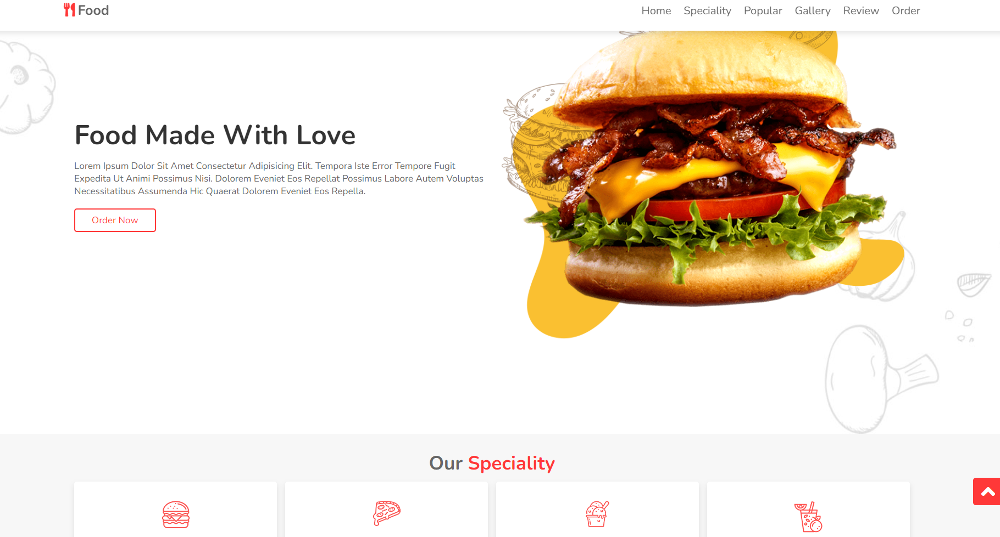

# Responsive-food-website

   <h2>Welcome! 👋</h2>

Thanks for checking out this single page responsive food website.

### Usage
Users should be able to:

- Expereience smooth scrolling
- Hover:
   - Buttons
   - Images
   - Navbar

### Built with:

- HTML
- CSS Flexbox
- CSS Grid
- JavaScript

## Author
GitHub - retroNG
